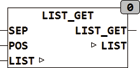

<!--
  Copyright (c) 2026 Hans Mühlbauer, Franz Höpfinger and others.

  This program and the accompanying materials are made available under the
  terms of the Eclipse Public License 2.0 which is available at
  https://www.eclipse.org/legal/epl-2.0

  SPDX-License-Identifier: EPL-2.0
-->

## LIST_GET

| | |
|:---|:---|
| **Type	Funktion** | STRING(LIST_LENGTH) |
| **Input	SEP** | BYTE (Separationszeichen der Liste) |
| **POS** | INT (Position des Listenelements) |
| **I/O	LIST** | STRING(LIST_LENGTH) (Eingangsliste) |
| **Output** | STRING (Ausgangsstring) |
| | LIST_GET lieferte das Element an der Stelle POS aus einer Liste. Die Liste besteht aus  Zeichenketten (Elementen) die mit dem Separationszeichen SEP beginnen. Das erste Element der Liste hat die Position 1. |



**Beispiel:**

```iecst
LIST_GET('&ABC&23&&NEXT', 38, 1) = 'ABC' LIST_GET('&ABC&23&&NEXT', 38, 2) = '23' LIST_GET('&ABC&23&&NEXT', 38, 3) = '' LIST_GET('&ABC&23&&NEXT', 38, 4) = 'NEXT' LIST_GET('&ABC&23&&NEXT', 38, 5) = '' LIST_GET('&ABC&23&&NEXT', 38, 0) = ''
```
