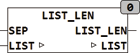

<!--
  Copyright (c) 2026 Hans Mühlbauer, Franz Höpfinger and others.

  This program and the accompanying materials are made available under the
  terms of the Eclipse Public License 2.0 which is available at
  https://www.eclipse.org/legal/epl-2.0

  SPDX-License-Identifier: EPL-2.0
-->

## LIST_LEN

| | |
|:---|:---|
| **Type	Funktion** | INT |
| **Input	SEP** | BYTE (Separationszeichen der Liste) |
| **I/O	LIST** | STRING(LIST_LENGTH) (Eingangsliste) |
| **Output** | INT (Anzahl der Elemente in der Liste) |
| | LIST_LEN ermittelt die Anzahl der Elemente in einer Liste. |
| | LIST_LEN('&0&1&2&3', 38) = 4 |
| | LIST_LEN('',21) = 0 |

