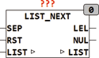

<!--
  Copyright (c) 2026 Hans Mühlbauer, Franz Höpfinger and others.

  This program and the accompanying materials are made available under the
  terms of the Eclipse Public License 2.0 which is available at
  https://www.eclipse.org/legal/epl-2.0

  SPDX-License-Identifier: EPL-2.0
-->

## LIST_NEXT

| | |
|:---|:---|
| **Type	Funktion** | STRING |
| **Input	SEP** | BYTE (Separationszeichen der Liste) |
| **RST** | BOOL (Asynchroner Reset) |
| **I/O	LIST** | STRING(LIST_LENGTH) (Eingangsliste) |
| **Output	LEL** | STRING(LIST_LENGTH) (Listenelement) |
| **NUL** | BOOL (TRUE wenn Liste abgearbeitet oder Leer ist) |
| | LIST_NEXT liefert jeweils das nächste Element aus einer Liste. Die Liste ist ein STRING dessen Elemente mit den Zeichen SEP beginnen.  Das erste Element der Liste hat die Position 1. Nach dem ersten Aufruf von LIST_NEXT oder einem Reset wird am Ausgang LEL das erste Element der Liste ausgegeben. Bei jedem weiteren Aufruf liefert der Baustein das nächste Element der Liste. Wenn das Ende der Liste erreicht ist wird eine Leere Zeichenkette Ausgegeben und der Ausgang NUL = TRUE gesetzt. Mit dem Kommando RST = TRUE kann die LISTE wieder von neuem bearbeitet werden. |



**Beispiel:**

Beispiel für die Anwendung:
```iecst
FUNCTION_BLOCK testll VAR_INPUT s1 : STRING(255); END_VAR VAR element : ARRAY[0..20] OF STRING(LIST_LENGTH); list_n : LIST_NEXT; pos : INT; END_VAR pos := 0; list_n(LIST := s1, SEP := 44); WHILE NOT list_n.NUL and pos <= 20 DO element[pos] := list_n.LEL; list_n(list := s1); pos := pos + 1; END_WHILE;
```
