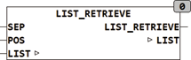

<!--
  Copyright (c) 2026 Hans Mühlbauer, Franz Höpfinger and others.

  This program and the accompanying materials are made available under the
  terms of the Eclipse Public License 2.0 which is available at
  https://www.eclipse.org/legal/epl-2.0

  SPDX-License-Identifier: EPL-2.0
-->

## LIST_RETRIEVE

| | |
|:---|:---|
| **Type	Funktion** | STRING |
| **Input	SEP** | BYTE (Separationszeichen der Liste) |
| **POS** | INT (Position des Listenelements) |
| **I/O	LIST** | STRING(LIST_LENGTH) (Eingangsliste) |
| **Output** | STRING(LIST_LENGTH) (Ausgangsstring) |
| | LIST_RETRIEVE lieferte das Element an der Stelle POS aus einer Liste und löscht das entsprechende Element aus der Liste. Die Liste besteht aus  Zeichenketten (Elementen) die mit dem Separationszeichen SEP beginnen. Das erste Element der Liste hat die Position 1. Die Funktion liefert einen leeren String wenn an der Stelle POS kein Element vorhanden ist. |



**Beispiel:**

```iecst
LIST_RETRIEVE('&ABC&23&&NX&, 38, 1) = 'ABC'	LIST = '&23&&NX&' LIST_RETRIEVE('&ABC&23&&NX', 38, 2) = '23'	LIST = '&ABC&&NX' LIST_RETRIEVE('&ABC&23&&NX', 38, 3) = ''	LIST = '&ABC&23&NX' LIST_RETRIEVE('&ABC&23&&NX', 38, 4) = 'NEXT'	LIST = '&ABC&23&' LIST_RETRIEVE('&ABC&23&&NX', 38, 5) = ''	LIST = '&ABC&23&&NX' LIST_RETRIEVE('&ABC&23&&NX', 38, 0) = ''	LIST = '&ABC&23&&NX'
```
