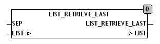

<!--
  Copyright (c) 2026 Hans Mühlbauer, Franz Höpfinger and others.

  This program and the accompanying materials are made available under the
  terms of the Eclipse Public License 2.0 which is available at
  https://www.eclipse.org/legal/epl-2.0

  SPDX-License-Identifier: EPL-2.0
-->

## LIST_RETRIEVE_LAST

| | |
|:---|:---|
| **Type	Funktion** | STRING(LIST_LENGTH) |
| **Input	SEP** | BYTE (Separationszeichen der Liste) |
| **I/O	LIST** | STRING(LIST_LENGTH) (Eingangsliste) |
| **Output** | STRING(LIST_LENGTH) (Ausgangsstring) |
| | LIST_RETRIEVE_LAST lieferte das letzte Element aus einer Liste und löscht das entsprechende Element aus der Liste. Die Liste besteht aus  Zeichenketten (Elementen) die mit dem Separationszeichen SEP beginnen. |

