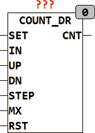

<!--
  Copyright (c) 2026 Hans Mühlbauer, Franz Höpfinger and others.

  This program and the accompanying materials are made available under the
  terms of the Eclipse Public License 2.0 which is available at
  https://www.eclipse.org/legal/epl-2.0

  SPDX-License-Identifier: EPL-2.0
-->

## COUNT_DR

| | |
|:---|:---|
| **Type** | Funktionsbaustein |
| **Input	SET** | BOOL (asynchroner Set) |
| **IN** | DWORD (Vorgabewert für Set) |
| **UP** | BOOL (Vorwärts Schalter flankengetriggert) |
| **DN** | BOOL (Rückwärts Schalter flankengetriggert) |
| **STEP** | DWORD (Schrittweite des Counters) |
| **MX** | DWORD (Maximalwert des Counters) |
| **RST** | BOOL (asynchroner Reset) |
| **Output	CNT** | DWORD (Ausgang) |
| | COUNT_DR ist ein DWORD (32-Bit) Zähler der von 0 bis MX zählt und dann wieder bei 0 beginnt. Der Zähler kann mittels 2 flankengetriggerten Eingängen UP und DN sowohl vorwärts als auch Rückwärts Zählen. beim erreichen eines Endwerts 0 oder MX wird wieder bei 0 beziehungsweise MX weiter gezählt. Der Eingang STEP legt die Schrittweite des Zählers fest. Mit einem TRUE am Eingang SET wird der Zähler auf den an IN anliegenden Wert gesetzt. Ein Reset Eingang RST setzt den Zähler jederzeit auf 0. |
| **Falls die unabhängigen Eingänge UP und DN mit CLK und einen Steuereingang UP/DN ersetzt werden sollen kann dies mittels zwei AND Gattern vor den Eingängen erfolgen** |  |

|  | SET | IN | UP | DN | STEP | RST | CNT |
| --- | --- | --- | --- | --- | --- | --- | --- |
| Reset | - | - | - | - | - | 1 | 0 |
| Set | 1 | N | - | - | - | 0 | N |
| up | 0 | - | ↑ | 0 | N | 0 | CNT + N |
| down | 0 | - | 0 | ↑ | N | 0 | CNT - N |
