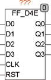

<!--
  Copyright (c) 2026 Hans Mühlbauer, Franz Höpfinger and others.

  This program and the accompanying materials are made available under the
  terms of the Eclipse Public License 2.0 which is available at
  https://www.eclipse.org/legal/epl-2.0

  SPDX-License-Identifier: EPL-2.0
-->

## Type	Funktionsbaustein

| | |
|:---|:---|
| **Input	D0** | BOOL (Data 0 in) |
| **D1** | BOOL (Data 1 in) |
| **D2** | BOOL (Data 2 in) |
| **D3** | BOOL (Data 3 in) |
| **CLK** | BOOL (Takteingang) |
| **RST** | BOOL (asynchroner Reset) |
| **Output	Q0** | BOOL (Data 0 Out) |
| **Q1** | BOOL (Data 1 Out) |
| **Q2** | BOOL (Data 2 Out) |
| **Q3** | BOOL (Data 3 Out) |
| | FF_D2E ist ein 4 Bit flankengetriggertes D-Flip-Flop mit asynchronem Reset-Eingang. Das D-Flip-Flop speichert die Werte am Eingang D mit einer steigenden Flanke an CLK. Detaillierte Angaben finden Sie beim Baustein FF_D2E. |

