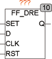

<!--
  Copyright (c) 2026 Hans Mühlbauer, Franz Höpfinger and others.

  This program and the accompanying materials are made available under the
  terms of the Eclipse Public License 2.0 which is available at
  https://www.eclipse.org/legal/epl-2.0

  SPDX-License-Identifier: EPL-2.0
-->

## Type	Funktionsbaustein

| | |
|:---|:---|
| **Input	SET** | BOOL (asynchroner Set) |
| **D** | BOOL (Data in) |
| **CLK** | BOOL (Takteingang) |
| **RST** | BOOL (asynchroner Reset) |
| **Output	Q** | BOOL (Data Out) |
| | FF_DRE ist ein flankengetriggertes D-Flip-Flop mit asynchronem Set und Reset Eingang. Eine steigende Flanke an CLK speichert den Eingang D auf den Ausgang Q. Ein TRUE am SET oder RST-Eingang setzt oder löscht den Ausgang Q zu jeder Zeit unabhängig von CLK. Der Reset Eingang hat Vorrang vor den Set Eingang. Wenn beide aktiv (TRUE) sind wird ein Reset ausgeführt und Set ignoriert. |

