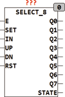

<!--
  Copyright (c) 2026 Hans Mühlbauer, Franz Höpfinger and others.

  This program and the accompanying materials are made available under the
  terms of the Eclipse Public License 2.0 which is available at
  https://www.eclipse.org/legal/epl-2.0

  SPDX-License-Identifier: EPL-2.0
-->

## Type	Funktionsbaustein

| | |
|:---|:---|
| **Input	E** | BOOL (Enable für Ausgänge) |
| **SET** | BOOL (asynchroner Set) |
| **IN** | BYTE (Vorgabewert für Set) |
| **UP** | BOOL (Vorwärts Schalter flankengetriggert) |
| **DN** | BOOL (Rückwärts Schalter flankengetriggert) |
| **RST** | BOOL (asynchroner Reset) |
| **Output	Q0 .. Q7** | BOOL (Ausgänge) |
| **STATE** | BYTE (Status Ausgang) |
| | SELECT_8 setzt immer nur einen Ausgang auf TRUE solange E auf TRUE ist. Der aktive Ausgang Q0..Q7 kann mittels des SET Eingangs und dem Wert am Eingang IN Selektiert werden. Ein TRUE an SET und ein Wert von 5 am Eingang IN setzen den Ausgang Q5 auf TRUE während alle anderen Ausgänge auf FALSE gesetzt werden. Ein TRUE am Eingang RST setzt Ausgang Q0 auf TRUE. Mit den Eingängen UP wird von einem Ausgang Qn auf Qn+1 weiter geschaltet, während der Eingang DN von einen Ausgang Qn auf Qn-1 schaltet. Der Eingang EN muss TRUE sein damit ein Ausgang TRUE wird, ist EN FALSE werden alle Ausgänge FALSE. Ein FALSE an E beeinflusst aber nicht die Funktion der anderen Eingänge. So kann auch bei einem FALSE am Eingang EN mit UP oder DN hoch oder runter geschaltet werden. Die Eingänge UP und DN sind flankengetriggert und reagieren nur auf die steigende Flanke. Der Ausgang STATE zeigt immer an welcher Ausgang gerade selektiert ist. |

|  | E | SET | IN | UP | DN | RST | Q | STATE |
| --- | --- | --- | --- | --- | --- | --- | --- | --- |
| Reset | X | - | - | - | - | 1 | Q0 if EN=1 | 0 |
| Set | X | 1 | N | - | - | 0 | QN if EN=1 | N |
| up | X | 0 | - | ↑ | 0 | 0 | QN+1 if EN=1 | N + 1 |
| down | X | 0 | - | 0 | ↑ | 0 | QN-1 if EN=1 | N - 1 |
