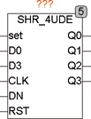
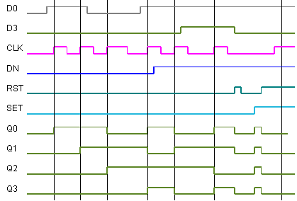

<!--
  Copyright (c) 2026 Hans Mühlbauer, Franz Höpfinger and others.

  This program and the accompanying materials are made available under the
  terms of the Eclipse Public License 2.0 which is available at
  https://www.eclipse.org/legal/epl-2.0

  SPDX-License-Identifier: EPL-2.0
-->

## Type	Funktionsbaustein

| | |
|:---|:---|
| **Input	SET** | BOOL (asynchroner Set) |
| **D0** | BOOL (Data Input Bit 0) |
| **D3** | BOOL (Data Input Bit 3) |
| **CLK** | BOOL (Takteingang) |
| **DN** | BOOL (Steuereingang Up / Down, TRUE = Down) |
| **RST** | BOOL (asynchroner Reset) |
| **Output	Q0** | BOOL (Data Out 0) |
| **Q1** | BOOL (Data Out 1) |
| **Q2** | BOOL (Data Out 2) |
| **Q3** | BOOL (Data Out 3) |
| | SHR_4UDE ist ein 4 Bit Schieberegister mit Up / Down Schieberichtungen. Mit einer steigenden Flanke an CLK wird Q2 nach Q3 geschoben, Q1 nach Q2, Q0 nach Q1 und D0 nach Q0 gespeichert. Die Schieberichtung kann mit einem TRUE am Eingang DN umgekehrt werden, dann wird D3 nach Q3 – nach Q2 – nach Q1 – nach Q0 geschoben. Mit einem TRUE am Set-Eingang werden alle Ausgänge (Q0 .. Q3) auf TRUE gesetzt und mit RST werden alle Eingänge auf FALSE gesetzt. |

