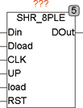

<!--
  Copyright (c) 2026 Hans Mühlbauer, Franz Höpfinger and others.

  This program and the accompanying materials are made available under the
  terms of the Eclipse Public License 2.0 which is available at
  https://www.eclipse.org/legal/epl-2.0

  SPDX-License-Identifier: EPL-2.0
-->

## Type	Funktionsbaustein

| | |
|:---|:---|
| **Input	DIN** | BOOL (Shift Data Input) |
| **DLOAD** | Byte (Datenwort zum Parallel Load) |
| **CLK** | BOOL (Takteingang) |
| **UP** | BOOL (Steuereingang Up / Down, TRUE = Up) |
| **LOAD** | BOOL (Steuereingang zum Laden des Registers) |
| **RST** | BOOL (asynchroner Reset) |
| **Output	DOUT** | BOOL (Data Out) |
| | SHR_8PLE ist ein 8 Bit Schieberegister mit Parallel Load und asynchronem Reset. Die Schieberichtung kann mit dem Eingang UP umgekehrt werden. Wenn UP=1, wird Bit 7 zuerst auf DOUT geschoben und wenn UP=0, wird Bit0 zuerst an DOUT geschoben. Für Up-Shift wird Bit 0 mit DIN geladen und bei Down-Shift wird Bit 7 mit DIN geladen. Am Eingang DLOAD liegt ein Byte Daten an, das bei Parallel Load (LOAD=1 und steigende Flanke an CLK) ins interne Register geladen wird. Im Falle von Parallel Load wird zuerst ein Shift durchgeführt und anschließend das Register geladen. Ein RST kann jederzeit asynchron das Register löschen. Eine eingehende Beschreibung eines Schieberegisters finden Sie beim Modul SHR_4E. |

