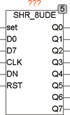

<!--
  Copyright (c) 2026 Hans Mühlbauer, Franz Höpfinger and others.

  This program and the accompanying materials are made available under the
  terms of the Eclipse Public License 2.0 which is available at
  https://www.eclipse.org/legal/epl-2.0

  SPDX-License-Identifier: EPL-2.0
-->

## Type	Funktionsbaustein

| | |
|:---|:---|
| **Input	SET** | BOOL (asynchroner Set) |
| **D0** | BOOL (Data Input Bit 0) |
| **D3** | BOOL (Data Input Bit 3) |
| **CLK** | BOOL (Takteingang) |
| **DN** | BOOL (Steuereingang Up / Down, TRUE = Down) |
| **RST** | BOOL (asynchroner Reset) |
| **Output	Q0 .. Q7** | BOOL (Data Out) |
| | SHR_8UDE ist ein 8 Bit Schieberegister mit Up / Down Schieberichtung. Mit einer steigenden Flanke an CLK werden die Daten Q0 nach Q7 um jeweils einen Schritt geschoben. Q0 wird anschließend mit D0 geladen. Die Schieberichtung kann mit einem TRUE am Eingang DN umgekehrt werden. Dann wird D7 nach Q6, Q5, Q4, Q3, Q2, Q1, Q0 geschoben und Q7 mit D7 geladen. Mit einem TRUE am Set-Eingang werden alle Ausgänge (Q0 .. Q3) auf TRUE gesetzt und mit RST werden alle Ausgänge auf FALSE gesetzt. Weitergehende Erläuterungen zu Schieberegistern finden Sie unter SHR_4E und speziell beim Modul SHR_4UDE, welches die gleiche Funktion für 4 Bits  wie SHR_8UDE für 8 Bits erfüllt. |

