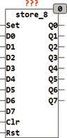

<!--
  Copyright (c) 2026 Hans Mühlbauer, Franz Höpfinger and others.

  This program and the accompanying materials are made available under the
  terms of the Eclipse Public License 2.0 which is available at
  https://www.eclipse.org/legal/epl-2.0

  SPDX-License-Identifier: EPL-2.0
-->

## Type	Funktionsbaustein

| | |
|:---|:---|
| **Input	SET** | BOOL (asynchroner Set) |
| **D0..D7** | BOOL (Data Input Bit 0..7) |
| **CLR** | BOOL (Schrittweise Rücksetzen Eingang) |
| **RST** | BOOL (Asynchroner Set Eingang) |
| **Output	Q0..Q7** | BOOL (Ereignis Ausgänge) |
| | STORE_8 ist ein 8-fach Ereignisspeicher. ein TRUE an einem der Eingänge D0..D7 setzt den entsprechenden Ausgang Q0..Q7. Die Asynchronen Set und Reset Eingänge (SET, RST) setzen alle Ausgänge gleichzeitig auf TRUE oder FALSE. ist während eines Resets einer der Eingänge TRUE wird nach dem Reset der entsprechende Ausgang sofort wieder auf TRUE gesetzt. Falls flankengetriggerte Eingänge gewünscht werden, so sind vor dem Baustein STRORE_8 TP_R Bausteine einzusetzen. Dies erlaubt es dem Anwender sowohl flanken- wie auch zustands- getriggerte Eingänge gleichzeitig zu verwenden. Der Eingang CLR löscht mit einer steigenden Flanke an CLR immer nur ein Ereignis, beginnend mit dem am höchsten priorisierten Ausgang der gerade TRUE ist.  Wird mit CLR ein Ausgang Q gelöscht dessen Eingang D noch TRUE ist so wird der Ausgang D mit dem nächsten Zyklus wieder auf TRUE gesetzt. |

