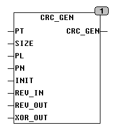

<!--
  Copyright (c) 2026 Hans Mühlbauer, Franz Höpfinger and others.

  This program and the accompanying materials are made available under the
  terms of the Eclipse Public License 2.0 which is available at
  https://www.eclipse.org/legal/epl-2.0

  SPDX-License-Identifier: EPL-2.0
-->

## CRC_GEN

| | |
|:---|:---|
| **Type	Funktion** | DWORD |
| **Input	PT** | POINTER TO ARRAY OF BYTE (Datenpaket) |
| **SIZE** | UINT (Größe des Arrays) |
| **Output** | DWORD (errechnete CRC-Checksumme) |
| **CRC_GEN generiert eine CRC-Checksumme aus einen beliebig großen Array of Byte. Beim Aufruf wird der Funktion ein Pointer auf das zu bearbeitende Array und dessen Größe in Bytes übergeben. Unter CoDeSys lautet der Aufruf** | CRC_GEN(ADR(Array), SIZEOF(Array),...), wobei Array der Name des zu bearbeitenden Arrays ist. ADR ist eine Standardfunktion, die den Pointer auf das Array ermittelt und SIZEOF ist eine Standardfunktion, die die Größe des Arrays ermittelt. Das Polynom kann ein beliebiges POLYNOM bis maximal 32 Bit Länge sein. Ein Polynom X³ + X² + 1 wird mit 101 dargestellt (1*X³ + 1*X² + 0*X¹ + 1* X⁰). Das höchstwertige Bit, in diesem Fall 1*X³ wird dabei im Polynom nicht angegeben den es ist immer eins. Es können Polynome bis X³² (CRC 32) verarbeitet werden.Durch den Wert INIT kann dem CR eine Startwert übergeben werden, üblich sind hier 0000 und FFFF. Der zu verwendende Startwert ist der in der Literatur übliche „Direct Initial Value“. Der Eingan XOR_OUT legt fest mit welcher Bitfolge die Checksumme am Ende mit XOR verknüpft wird. Die Eingänge REV_IN und REV_OUT legen die Bitfolge der Daten Fest. Wenn REV_IN = TRUE wird jedes Byte mit LSB beginnend verarbeitet, REV_IN = FALSE wird jeweils mit MSB begonnen. REV_OUT=TRUE dreht entsprechend die Bitfolge der Checksumme um. Der Bautein benötigt eine Mindestlänge der zu verarbeitenden Daten von 4 Bytes, und ist nach oben nur durch die maximale Array Größe begrenzt. |
| | Die weiter unten folgende CRC Tabelle gibt nähere Auskunft über gebräuchliche CRC's und deren Setup Daten für CRC_GEN. Aufgrund der Vielzahl von möglichen und auch gebräuchlichen CRC's ist es uns nicht möglich eine vollständige Liste aufzuführen. |
| **Für weitergehende Recherchen ist die Webseite http** | //regregex.bbcmicro.net/crc-catalogue.htm zu empfehlen. |
| **Online Berechnungen zum testen sind mit folgendem Java Tool möglich** | http://zorc.breitbandkatze.de/crc.html |
| **Gebräuchliche CRC'S UND Polynome** |  |
| **Setup	PL** | UINT (Länge des Polynoms) |
| **PN** | DWORD (Polynom) |
| **INIT** | DWORD (INIT Daten) |
| **REV_IN** | BOOL (Eingangsdaten Bytes Umkehren) |
| **REV_OUT** | BOOL (Ausgangsdaten Umkehren) |
| **XOR_OUT** | DWORD (Letztes XOR des Ausgangs) |

| CRC | PL | PN [Hex] | INIT [Hex] | REV IN | REV OUT | XOUT [Hex] |
| --- | --- | --- | --- | --- | --- | --- |
| CRC-3/ROHC | 3 | 3 | 7 | T | T | 0 |
| CRC-4/ITU | 4 | 3 | 0 | T | T | 0 |
| CRC-5/EPC | 5 | 9 | 9 | F | F | 0 |
| CRC-5/ITU | 5 | 15 | 0 | T | T | 0 |
| CRC-5/USB | 5 | 5 | 1F | T | T | 1F |
| CRC-6/DARC | 6 | 19 | 0 | T | F | 0 |
| CRC-6/ITU | 6 | 3 | 0 | T | T | 0 |
| CRC-7 | 7 | 9 | 0 | F | F | 0 |
| CRC-7/ROHC | 7 | 4F | 7F | T | T | 0 |
| CRC-8 | 8 | 7 | 0 | F | F | 0 |
| CRC-8/DARC | 8 | 39 | 0 | T | T | 0 |
| CRC-8/I-CODE | 8 | 1D | FD | F | F | 0 |
| CRC-8/ITU | 8 | 7 | 0 | F | F | 55 |
| CRC-8/MAXIM | 8 | 31 | 0 | T | T | 0 |
| CRC-8/ROHC | 8 | 7 | FF | T | T | 0 |
| CRC-8/WCDMA | 8 | 9B | 0 | T | T | 0 |
| CRC-10 | 10 | 233 | 0 | F | F | 0 |
| CRC-11 | 11 | 385 | 1A | F | F | 0 |
| CRC-12/3GPP | 12 | 80F | 0 | F | T | 0 |
| CRC-12/DECT | 12 | 80F | 0 | F | F | 0 |
| CRC-14/DARC | 14 | 805 | 0 | T | T | 0 |
| CRC-15 | 15 | 4599 | 0 | F | F | 0 |
| CRC-16/LHA | 16 | 8005 | 0 | T | T | 0 |
| CRC-16/CCITT-AUG | 16 | 1021 | 1D0F | F | F | 0 |
| CRC-16/BUYPASS | 16 | 8005 | 0 | F | F | 0 |
| CRC-16/CCITT-FALSE | 16 | 1021 | FFFF | F | F | 0 |
| CRC-16/DDS | 16 | 8005 | 800D | F | F | 0 |
| CRC-16/DECT-R | 16 | 589 | 0 | F | F | 1 |
| CRC-16/DECT-X | 16 | 589 | 0 | F | F | 0 |
| CRC-16/DNP | 16 | 3D65 | 0 | T | T | FFFF |
| CRC-16/EN13757 | 16 | 3D65 | 0 | F | F | FFFF |
| CRC-16/GENIBUS | 16 | 1021 | FFFF | F | F | FFFF |
| CRC-16/MAXIM | 16 | 8005 | 0 | T | T | FFFF |
| CRC-16/MCRF4XX | 16 | 1021 | FFFF | T | T | 0 |
| CRC-16/RIELLO | 16 | 1021 | B2AA | T | T | 0 |
| CRC-16/T10-DIF | 16 | 8BB7 | 0 | F | F | 0 |
| CRC-16/TELEDISK | 16 | A097 | 0 | F | F | 0 |
| CRC-16/USB | 16 | 8005 | FFFF | T | T | FFFF |
| CRC-16/CCITT-TRUE | 16 | 1021 | 0 | T | T | 0 |
| CRC-16/MODBUS | 16 | 8005 | FFFF | T | T | 0 |
| CRC-16/X-25 | 16 | 1021 | FFFF | T | T | FFFF |
| CRC-16/XMODEM | 16 | 1021 | 0 | F | F | 0 |
| CRC-24/OPENPGP | 24 | 864CFB | B704CE | F | F | 0 |
| CRC-24/FLEXRAY-A | 24 | 5D6DCB | FEDCBA | F | F | 0 |
| CRC-24/FLEXRAY-B | 24 | 5D6DCB | ABCDEF | F | F | 0 |
| CRC-32/PKZIP | 32 | 04C11DB7 | FFFFFFFF | T | T | FFFFFFFF |
| CRC-32/BZIP2 | 32 | 04C11DB7 | FFFFFFFF | F | F | FFFFFFFF |
| CRC-32/CASTAGNOLI | 32 | 1EDC6F41 | FFFFFFFF | T | T | FFFFFFFF |
| CRC-32/D | 32 | A833982B | FFFFFFFF | T | T | FFFFFFFF |
| CRC-32/MPEG2 | 32 | 04C11DB7 | FFFFFFFF | F | F | 0 |
| CRC-32/POSIX | 32 | 04C11DB7 | 0 | F | F | FFFFFFFF |
| CRC-32/Q | 32 | 814141AB | 0 | F | F | 0 |
| CRC-32/JAM | 32 | 04C11DB7 | FFFFFFFF | T | T | 0 |
| CRC-32/XFER | 32 | AF | 0 | F | F | 0 |
