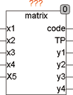
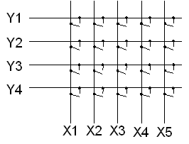
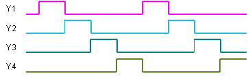

<!--
  Copyright (c) 2026 Hans Mühlbauer, Franz Höpfinger and others.

  This program and the accompanying materials are made available under the
  terms of the Eclipse Public License 2.0 which is available at
  https://www.eclipse.org/legal/epl-2.0

  SPDX-License-Identifier: EPL-2.0
-->

## MATRIX

| | |
|:---|:---|
| **Type** | Funktionsbaustein |
| **Input	X1 .. X5** | BOOL (Zeileneingänge) |
| **Setup	RELEASE** | BOOL (Ein Tastencode wird beim Drücken und  	loslassen einer Taste erzeugt) |
| **Output	CODE** | Byte (Ausgang für Tastencode) |
| **TP** | BOOL (TP ist für einen Zyklus TRUE, wenn ein neuer  	Tastencode ansteht) |
| **Y1 .. Y4** | BOOL (Zeilenausgänge) |
| **MATRIX ist ein Matrix-Tastatur-Controller für maximal 4 Spalten und 5 Zeilen. Mit jedem SPS Zyklus schaltet MATRIX den Spaltenausgang um eine Spalte weiter, sodass die Zeilen Y1 bis Y4 nacheinander abgefragt werden. Für jede Spalte werden die Zeileneingänge X1 bis X5 abgefragt und falls eine Taste gedrückt ist, wird der entsprechende Tastencode am Ausgang angezeigt. Der Ausgang TP ist genau dann einen Zyklus TRUE, wenn der Ausgang CODE einen neuen Wert anzeigt. Wenn die Setup-Variable RELEASE auf TRUE gesetzt wird, dann wird für das Drücken und das Loslassen einer Taste jeweils ein Tastencode gesendet. Falls RELEASE auf FALSE gesetzt ist, wird nur beim Betätigen einer Taste ein Tastencode erzeugt. Der Tastencode des Ausgangs setzt sich wie folgt zusammen** |  |
| **Der Matrixcontroller wird wie folgt beschaltet** |  |
| | Bei dieser einfachen Beschaltung können bis zu 20 ( 4 * 5 ) Taster ausgewertet werden. Jedoch ist hierbei zu beachten, dass nur bedingt mehrere Tasten gleichzeitig gedrückt werden können. Der Controller kann mit dieser Beschaltung mehrere Tasten in einer Spalte sicher erkennen, jedoch nicht wenn Tasten an verschiedenen Spalten gleichzeitig gedrückt werden. Die Beschaltung kann jedoch erweitert werden, indem jeder einzelne Taster über Dioden entkoppelt wird und damit die Beeinflussung verschiedener  Spalten untereinander verhindert wird. Bei der Beschaltung mit Dioden können beliebig viele Tasten gleichzeitig gedrückt und sicher Ausgewertet werden. Die Ausgänge des Matrixcontrollers scannen kontinuierlich die Zeilen der Tastaturmatrix ab. Je SPS Zyklus wird eine Zeile eingelesen. Sind in einer Zeile mehrere Tasten gedrückt bzw. verändert worden, so werden die Änderungen als Codes über die folgenden Zyklen ausgegeben. Der Baustein merkt sich die einzelnen Tastencodes und gibt je Zyklus immer nur einen Code aus, sodass kein Code verloren gehen kann. |

| **Das folgende Timing Diagramm zeigt das Abtasten der Tastenreihen** |  |

| Bit | CODE Output |
| --- | --- |
| 7 | 1 when key is pressed, 0 when key is released |
| 6 | Line number Bit 2 |
| 5 | Line number Bit 1 |
| 4 | Line number Bit 0 |
| 3 | Always 0 |
| 2 | Row number Bit 2 |
| 1 | Row Number Bit 1 |
| 0 | Row Number Bit 0 |
