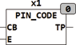

<!--
  Copyright (c) 2026 Hans Mühlbauer, Franz Höpfinger and others.

  This program and the accompanying materials are made available under the
  terms of the Eclipse Public License 2.0 which is available at
  https://www.eclipse.org/legal/epl-2.0

  SPDX-License-Identifier: EPL-2.0
-->

## PIN_CODE

| | |
|:---|:---|
| **Type** | Funktionsbaustein |
| **Input	CB** | BYTE (Eingang) |
| **E** | BOOL (Enable Eingang) |
| **Output** | TP (Trigger Ausgang) |
| | PIN_CODE überprüft einen Datenstrom von Bytes auf das Vorkommen einer bestimmten Sequenz. Tritt die Sequenz auf, wird dies mit einem TRUE am Ausgang TP signalisiert. |
| | Im folgenden Beispiel werden 2 Bausteine PIN_CODE verwendet um 2 CODE_SEQUENZEN einer Matrix Tastatur zu dekodieren. |
| **SETUP	PIN** | STRING(8) (zu prüfender String) |

