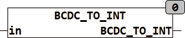

<!--
  Copyright (c) 2026 Hans Mühlbauer, Franz Höpfinger and others.

  This program and the accompanying materials are made available under the
  terms of the Eclipse Public License 2.0 which is available at
  https://www.eclipse.org/legal/epl-2.0

  SPDX-License-Identifier: EPL-2.0
-->

## Type	Funktion : INT

| | |
|:---|:---|
| **Input	IN** | BYTE (BCD codierter Eingang) |
| **Output** | INT (Ausgangswert) |
| | BCDC_TO_INT konvertiert ein BCD codiertes Eingangs BYTE in einen Integer Wert. |

