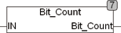

<!--
  Copyright (c) 2026 Hans Mühlbauer, Franz Höpfinger and others.

  This program and the accompanying materials are made available under the
  terms of the Eclipse Public License 2.0 which is available at
  https://www.eclipse.org/legal/epl-2.0

  SPDX-License-Identifier: EPL-2.0
-->

## Type	Funktion : INT

| | |
|:---|:---|
| **Input	IN** | DWORD (Eingang) |
| **Output** | INT (Anzahl der Bits, welche in IN den Wert TRUE (1) besitzen) |
| | BIT_COUNT ermittelt die Anzahl der Bits in IN, welche den Wert TRUE (1) besitzen. Der Eingang IN ist DWORD und Kann auch die Typen Byte und Word verarbeiten. |

