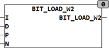

<!--
  Copyright (c) 2026 Hans Mühlbauer, Franz Höpfinger and others.

  This program and the accompanying materials are made available under the
  terms of the Eclipse Public License 2.0 which is available at
  https://www.eclipse.org/legal/epl-2.0

  SPDX-License-Identifier: EPL-2.0
-->

## Type	Funktion : WORD

| | |
|:---|:---|
| **Input	I** | WORD (Eingangs Wert) |
| **D** | BOOL (Wert der zu ladenden Bits) |
| **P** | INT (Position des zu ladenden Bits) |
| **N** | INT (Anzahl der Bits die ab Position P geladen werden) |
| **Output** | WORD (Ausgang) |
| | BIT_LOAD_W2 kann mehrere Bits in einem WORD gleichzeitig setzen oder löschen. Die Position wird mit 0 für Bit 0 und 15 für Bit 15 angegeben. N gibt an wie viele Bits ab der angegebenen Position verändert werden. Wird N = 0 werden keine Bits verändert. Wird P und N so spezifiziert, dass die zu schreibenden Bits über das höchste (Bit 15) hinausreicht so wird wieder bei Bit 0 begonnen. |

**Beispiel:**

Beispiele siehe unter BIT_LOAD_B2
