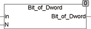

<!--
  Copyright (c) 2026 Hans Mühlbauer, Franz Höpfinger and others.

  This program and the accompanying materials are made available under the
  terms of the Eclipse Public License 2.0 which is available at
  https://www.eclipse.org/legal/epl-2.0

  SPDX-License-Identifier: EPL-2.0
-->

## Type	Funktion : BOOL

| | |
|:---|:---|
| **Input	IN** | DWORD (Eingang) |
| **N** | INT (Nummer des Bits 0..31) |
| **Output** | BOOL (Ausgangsbit) |
| | BIT_OF_DWORD extrahiert ein Bit aus dem DWORD am Eingang IN. |
| | Bit0 für N=0, Bit1 für N=1 usw. |

