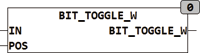

<!--
  Copyright (c) 2026 Hans Mühlbauer, Franz Höpfinger and others.

  This program and the accompanying materials are made available under the
  terms of the Eclipse Public License 2.0 which is available at
  https://www.eclipse.org/legal/epl-2.0

  SPDX-License-Identifier: EPL-2.0
-->

## Type	Funktion : WORD

| | |
|:---|:---|
| **Input	IN** | WORD (Eingangs Daten) |
| **POS** | INT (Position) |
| **Output** | WORD (Ausgangsbyte) |
| | BIT_TOGGLE_W invertiert ein mit POS spezifiziertes Bit von IN. |
| | BIT_TOGGLE_B(2#0000_1111, 2) = 2#0000_1011 |
| | BIT_TOGGLE_B(2#0000_1111, 7) = 2#1000_1111 |

