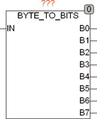

<!--
  Copyright (c) 2026 Hans Mühlbauer, Franz Höpfinger and others.

  This program and the accompanying materials are made available under the
  terms of the Eclipse Public License 2.0 which is available at
  https://www.eclipse.org/legal/epl-2.0

  SPDX-License-Identifier: EPL-2.0
-->

## Type	Funktionsbaustein

| | |
|:---|:---|
| **Input	IN** | BYTE (Eingangs Byte) |
| **Output	B0 .. B7** | BOOL (Ausgangs Bits) |
| | BYTE_TO_BITS zerlegt ein Byte (IN) in seine einzelnen Bits (B0 .. B7). Der Eingang IN ist als DWORD definiert, um wahlweise Byte, Word oder DWORD am Eingang verarbeiten zu können. Wird ein Word oder DWORD am Eingang verwendet, so werden nur die Bits 0..7 verarbeitet. Ein DWORD kann dann mit dem Standardbefehl SHR  um 8 Bits nach Rechts verschoben und so das nächste Byte verarbeitet werden. |

