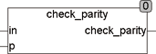

<!--
  Copyright (c) 2026 Hans Mühlbauer, Franz Höpfinger and others.

  This program and the accompanying materials are made available under the
  terms of the Eclipse Public License 2.0 which is available at
  https://www.eclipse.org/legal/epl-2.0

  SPDX-License-Identifier: EPL-2.0
-->

## Type	Funktion : BOOL

| | |
|:---|:---|
| **Input	IN** | BYTE (Eingangsbyte) |
| **P** | BOOL (Parity-Bit) |
| **Output** | BYTE (Ausgang ist bei gerader Parität TRUE) |
| | CHECK_PARITY überprüft ein Eingangsbyte IN und ein zugehöriges Parity-Bit P auf gerade Parität. Der Ausgang ist TRUE, wenn die Anzahl der Bits im Byte IN die den Wert TRUE besitzen zusammen mit dem Parity-Bit P eine gerade Anzahl ergeben. |

**Beispiel:**

Beispiel für Ausgang = TRUE: Beispiel für Ausgang = FALSE:
