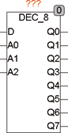
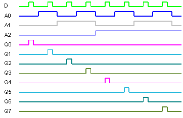

<!--
  Copyright (c) 2026 Hans Mühlbauer, Franz Höpfinger and others.

  This program and the accompanying materials are made available under the
  terms of the Eclipse Public License 2.0 which is available at
  https://www.eclipse.org/legal/epl-2.0

  SPDX-License-Identifier: EPL-2.0
-->

## Type	Funktionsbaustein

| | |
|:---|:---|
| **Input	D** | BOOL (Eingangs Bit) |
| **A0** | BOOL (Adresse Bit0) |
| **A1** | BOOL (Adresse Bit1) |
| **A2** | BOOL (Adresse Bit2) |
| **Output	Q0** | BOOL (TRUE bei A0=0 und A1=0 und A2=0) |
| **Q1** | BOOL (TRUE bei A0=1 und A1=0 und A2=0) |
| **Q2** | BOOL (TRUE bei A0=0 und A1=1 und A2=0) |
| **Q3** | BOOL (TRUE bei A0=1 und A1=1 und A2=0) |
| **Q4** | BOOL (TRUE bei A0=0 und A1=0 und A2=1) |
| **Q5** | BOOL (TRUE bei A0=1 und A1=0 und A2=1) |
| **Q6** | BOOL (TRUE bei A0=0 und A1=1 und A2=1) |
| **Q7** | BOOL (TRUE bei A0=1 und A1=1 und A2=1) |
| **DEC_8 ist ein 8-Bit Dekodierbaustein. Ist A0=0 und A1=0 und A2=0 wird der Eingang D auf Ausgang Q0 geschaltet, wenn A0=1 und A1=1 und A2=1 wird D auf Q3 geschaltet. Mit anderen Worten** | Q0=1 wenn D=1 und A0=0 und A1=0 und A2=0. |
| **Das folgende Schaubild verdeutlicht die Logik des Bausteins** |  |
| **Logische Verknüpfung** |  |
| **Q0 = D & /A0 & /A1 & /A2** | Q1 = D & A0 & /A1 & /A2 |
| **Q2 = D & /A0 & A1 & /A2** | Q3 = D & A0 & A1 & /A |
| **Q4 = D & /A0 & /A1 & A2** | Q5 = D & A0 & /A1 & A2 |
| **Q6 = D & /A0 & A1 & A2** | Q7 = D & A0 & A1 & A2 |

