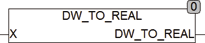

<!--
  Copyright (c) 2026 Hans Mühlbauer, Franz Höpfinger and others.

  This program and the accompanying materials are made available under the
  terms of the Eclipse Public License 2.0 which is available at
  https://www.eclipse.org/legal/epl-2.0

  SPDX-License-Identifier: EPL-2.0
-->

## Type	Funktion : REAL

| | |
|:---|:---|
| **Input	X** | DWORD (Eingang) |
| **Output** | REAL (Ausgangswert) |
| | DW_TO_REAL kopiert das Bitmuster eines DWORD (IN) in einen REAL. Es werden dabei die einzelnen Bits kopiert ohne auf deren Bedeutung zu achten. Die Funktion REAL_TO_DW ist die Umkehrfunktion so das die Konvertierung von REAL_TO_DW und anschließend DW_TO_REAL wiederum den Ausgangswert ergeben. Die IEC Standardfunktion DWORD_TO_REAL wandelt den Wert des DWORDS in einen REAL Wert. |

