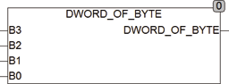

<!--
  Copyright (c) 2026 Hans Mühlbauer, Franz Höpfinger and others.

  This program and the accompanying materials are made available under the
  terms of the Eclipse Public License 2.0 which is available at
  https://www.eclipse.org/legal/epl-2.0

  SPDX-License-Identifier: EPL-2.0
-->

## Type	Funktion : DWORD

| | |
|:---|:---|
| **Input	B3** | Byte (Eingangs Byte 3) |
| **B2** | Byte (Eingangs Byte 2) |
| **B1** | Byte (Eingangs Byte 1) |
| **B0** | Byte (Eingangs Byte 0) |
| **Output** | DWORD (Ergebnis-DWORD) |
| | DWORD_OF_BYTE setzt aus 4 separaten Bytes B0 .. B3 ein DWORD zusammen. |
| **Ein DWORD setzt sich zusammen wie folgt** | B3-B2-B1-B0. |

