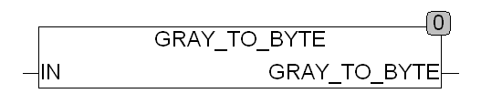

<!--
  Copyright (c) 2026 Hans Mühlbauer, Franz Höpfinger and others.

  This program and the accompanying materials are made available under the
  terms of the Eclipse Public License 2.0 which is available at
  https://www.eclipse.org/legal/epl-2.0

  SPDX-License-Identifier: EPL-2.0
-->

## Type	Funktion

| | |
|:---|:---|
| **Input	IN** | BYTE (Gray codierter Wert) |
| **Output** | Byte (Binärer Wert) |
| | GRAY_TO_BYTE wandelt einen Gray codierten Wert (IN) in ein Byte. |

