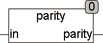

<!--
  Copyright (c) 2026 Hans Mühlbauer, Franz Höpfinger and others.

  This program and the accompanying materials are made available under the
  terms of the Eclipse Public License 2.0 which is available at
  https://www.eclipse.org/legal/epl-2.0

  SPDX-License-Identifier: EPL-2.0
-->

## PARITY

| | |
|:---|:---|
| **Type	Funktion** | BOOL |
| **Input	IN** | BYTE (Eingangs BYTE) |
| **Output** | BOOL (Ausgang ist TRUE, wenn Parität gerade ist) |
| | PARITY bildet eine gerade Parität über das Eingangsbyte IN. Der Ausgang ist TRUE wenn die Anzahl der TRUE Bits im Byte (In) ungerade ist. |

