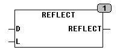

<!--
  Copyright (c) 2026 Hans Mühlbauer, Franz Höpfinger and others.

  This program and the accompanying materials are made available under the
  terms of the Eclipse Public License 2.0 which is available at
  https://www.eclipse.org/legal/epl-2.0

  SPDX-License-Identifier: EPL-2.0
-->

## REFLECT

| | |
|:---|:---|
| **Type	Funktion** | DWORD |
| **Input	D** | DWORD (Eingangswert) |
| **L** | INT (Anzahl der zu drehenden Bits) |
| **Output** | DWORD (Ausgangswert) |
| | REFLECT dreht die Reihenfolge der durch die Anzahl L spezifizierten BitsBits in einem DWORD um. Die höherwertigen Bits als die durch die Länge L spezifizierten bleiben unverändert. |



**Beispiel:**

```iecst
REVERSE(10101010 00000000 11111111 10011110, 8)
```
```iecst
ergibt 10101010 00000000 11111111 01111001
```

Beispiel:
```iecst
REVERSE(10101010 00000000 11111111 10011110, 32)
```
```iecst
ergibt 01111001 11111111 00000000 01010101
```

folgendes Beispiel in ST würde alle Bytes in einem DWORD X umdrehen, jedoch die Byte Reihenfolge belassen:
```iecst
FOR i := 0 TO 3 DO REVERSE(X, 8); ROR(X,8); END_FOR
```
