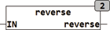

<!--
  Copyright (c) 2026 Hans Mühlbauer, Franz Höpfinger and others.

  This program and the accompanying materials are made available under the
  terms of the Eclipse Public License 2.0 which is available at
  https://www.eclipse.org/legal/epl-2.0

  SPDX-License-Identifier: EPL-2.0
-->

## REVERSE

| | |
|:---|:---|
| **Type	Funktion** | BYTE |
| **Input	IN** | BYTE (Eingangs BYTE) |
| **Output** | BYTE(Ausgangs Byte) |
| | REVERSE dreht die Reihenfolge der Bits in einem Byte um. Bit7 von IN wird zu Bit 0, Bit 6 wird zu Bit 1 usw. |



**Beispiel:**

```iecst
REVERSE(10011110) = 01111001
```
