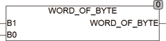

<!--
  Copyright (c) 2026 Hans Mühlbauer, Franz Höpfinger and others.

  This program and the accompanying materials are made available under the
  terms of the Eclipse Public License 2.0 which is available at
  https://www.eclipse.org/legal/epl-2.0

  SPDX-License-Identifier: EPL-2.0
-->

## Type	Funktion : WORD

| | |
|:---|:---|
| **Input	B1** | Byte (Eingangs Byte 1) |
| **B0** | Byte (Eingangs Byte 0) |
| **Output** | Word (Ergebnis Word) |
| | WORD_OF_BYTE setzt aus 2 separaten Bytes B0 und B1 ein Word zusammen. |

