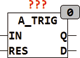

<!--
  Copyright (c) 2026 Hans Mühlbauer, Franz Höpfinger and others.

  This program and the accompanying materials are made available under the
  terms of the Eclipse Public License 2.0 which is available at
  https://www.eclipse.org/legal/epl-2.0

  SPDX-License-Identifier: EPL-2.0
-->

## Type	Funktionsbaustein

| | |
|:---|:---|
| **Input	IN** | REAL (Eingangssignal) |
| **RES** | REAL (Auflösung für Eingangsveränderung) |
| **Output	Q** | BOOL (Ausgangssignal) |
| **D** | REAL (letzte Veränderung des Eingangssignals) |
| | A_TRIG überwacht einen Eingangswert auf Veränderung und immer wenn der Eingangswert sich um mehr als RES verändert hat erzeugt der Baustein einen Ausgangsimpuls für einen Zyklus damit der neue Wert verarbeitet werden kann. Gleichzeitig merkt sich der Baustein den aktuellen Eingangswert mit denen er dann in den nächsten Zyklen den Eingang IN vergleicht. Am Ausgang D wird die Differenz zwischen dem gespeicherten Wert und IN angezeigt. |

