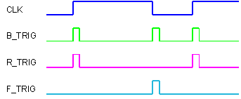

<!--
  Copyright (c) 2026 Hans Mühlbauer, Franz Höpfinger and others.

  This program and the accompanying materials are made available under the
  terms of the Eclipse Public License 2.0 which is available at
  https://www.eclipse.org/legal/epl-2.0

  SPDX-License-Identifier: EPL-2.0
-->

## Type	Funktionsbaustein

| | |
|:---|:---|
| **Input	CLK** | BOOL (Eingangssignal) |
| **Output	Q** | BOOL (Ausgangssignal) |
| | Der Funktionsbaustein B_TRIG erzeugt nach einem Flankenwechsel am Eingang CLK einen Ausgangsimpuls für exakt einen SPS-Zyklus. Im Gegensatz zu den beiden Standardfunktionsbausteinen R_TRIG und F_TRIG, die jeweils nur bei fallender oder steigender Flanke einen Puls erzeugen, erzeugt B_TRIG bei fallender und steigender Flanke einen Ausgangspuls. |

