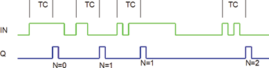

<!--
  Copyright (c) 2026 Hans Mühlbauer, Franz Höpfinger and others.

  This program and the accompanying materials are made available under the
  terms of the Eclipse Public License 2.0 which is available at
  https://www.eclipse.org/legal/epl-2.0

  SPDX-License-Identifier: EPL-2.0
-->

## Type	Funktionsbaustein

| | |
|:---|:---|
| **Input	IN** | BOOL (Eingangssignal) |
| **N** | INT (Anzahl der zu dekodierenden Clicks) |
| **TC** | TIME (Zeit in der die Clicks stattfinden müssen) |
| **Output	Q** | BOOL (Ausgangssignal) |
| | CLICK_CNT ermittelt die Anzahl der Impulse innerhalb der Zeiteinheit TC.am Eingang IN. Eine steigende Flanke an IN startet einen internen Timer mit der Zeit TC. Während des Ablaufs des Timers zählt der Baustein die fallenden Flanken an IN und überprüft nach Ablauf der Zeit TC ob N Impulse innerhalb der Zeit TC stattgefunden haben. Nur wenn exakt N Impulse innerhalb TC vorkommen wird der Ausgang Q für einen SPS Zyklus TRUE gesetzt. Der Baustein decodiert auch N=0 was einer steigenden Flanke aber keiner fallenden Flanke innerhalb von TC entspricht. |

