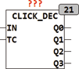

<!--
  Copyright (c) 2026 Hans Mühlbauer, Franz Höpfinger and others.

  This program and the accompanying materials are made available under the
  terms of the Eclipse Public License 2.0 which is available at
  https://www.eclipse.org/legal/epl-2.0

  SPDX-License-Identifier: EPL-2.0
-->

## Type	Funktionsbaustein

| | |
|:---|:---|
| **Input	IN** | BOOL (Eingangssignal) |
| **TC** | TIME (Zeit in der die Clicks stattfinden müssen) |
| **Output	Q0** | BOOL (Ausgangssignal für steigende Flanke |
| | ohne fallende Flanke) |
| **Q1** | BOOL (Ausgangssignal für einen Impuls innerhalb TC) |
| **Q2** | BOOL (Ausgangssignal für 2 Impulse innerhalb TC) |
| **Q3** | BOOL (Ausgangssignal für 3 Impulse innerhalb TC) |
| | CLICK_DEC dekodiert mehrfach Tastendrücke und signalisiert an verschiedenen Ausgängen die Anzahl der Impulse. Ein Eingangssignal ohne fallende Flanke innerhalb TC wird an Q0 ausgegeben und bleibt solange TRUE bis IN auf FALSE geht. Ein Impuls gefolgt von einem TRUE wird auf Q1 ausgegeben, usw. Wird innerhalb TC ein Impuls registriert, der vom Zustand FALSE gefolgt wird, so erscheint am entsprechenden Ausgang für einen SPS Zyklus ein TRUE. |

