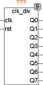

<!--
  Copyright (c) 2026 Hans Mühlbauer, Franz Höpfinger and others.

  This program and the accompanying materials are made available under the
  terms of the Eclipse Public License 2.0 which is available at
  https://www.eclipse.org/legal/epl-2.0

  SPDX-License-Identifier: EPL-2.0
-->

## Type	Funktionsbaustein

| | |
|:---|:---|
| **Input	CLK** | BOOL (Clock Eingang) |
| **RST** | BOOL (Reset Eingang) |
| **Output	Q0** | BOOL (Teiler Ausgang CLK / 2) |
| **Q1** | BOOL (Teiler Ausgang CLK / 4) |
| **Q2** | BOOL (Teiler Ausgang CLK / 8) |
| **Q3** | BOOL (Teiler Ausgang CLK / 16) |
| **Q4** | BOOL (Teiler Ausgang CLK / 32) |
| **Q5** | BOOL (Teiler Ausgang CLK / 64) |
| **Q6** | BOOL (Teiler Ausgang CLK / 128) |
| **Q7** | BOOL (Teiler Ausgang CLK / 256) |
| | Der Funktionsbaustein CLK_DIV ist ein Teilerbaustein, der ein Eingangssignal CLK in 8 Stufen durch jeweils 2 teilt, sodass am Ausgang Q0 die halbe Frequenz des Eingangs CLK mit 50% Tastverhältnis zur Verfügung steht. Der Ausgang Q1 stellt die halbierte Frequenz von Q0 zur Verfügung und so weiter, bis an Q7 die Eingangsfrequenz geteilt durch 256 bereitsteht. Ein Reset Eingang RST setzt asynchron alle Ausgänge auf FALSE. CLK darf jeweils nur einen Zyklus auf TRUE sein, falls CLK dies nicht tut muss CLK über ein TP_R bereitgestellt werden. |
| **Das folgende Beispiel ist eine Testschaltung mit Startsignal über ENI / ENO Funktionalität Realisiert. Bild 2 zeigt eine entsprechende Traceaufzeichnung der Schaltung** |  |

