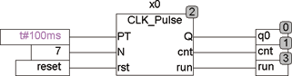
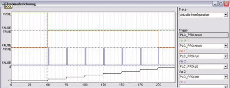

<!--
  Copyright (c) 2026 Hans Mühlbauer, Franz Höpfinger and others.

  This program and the accompanying materials are made available under the
  terms of the Eclipse Public License 2.0 which is available at
  https://www.eclipse.org/legal/epl-2.0

  SPDX-License-Identifier: EPL-2.0
-->

## Type	Funktionsbaustein

| | |
|:---|:---|
| **Input	PT** | TIME (Zykluszeit) |
| **N** | INT (Anzahl der zu erzeugenden Impulse) |
| **RST** | BOOL (Reset) |
| **Output	Q** | BOOL (Taktausgang) |
| **CNT** | INT (Zähler der Ausgangsimpulse) |
| **RUN** | BOOL (TRUE, wenn Pulsgenerator läuft) |
| | CLK_PULSE erzeugt eine definierte Anzahl von Taktimpulsen mit einem programmierbaren Tastverhältnis. PT legt das Tastverhältnis fest und N die Anzahl der zu erzeugenden Impulse. Durch einen Reset Eingang RST kann der Generator jederzeit erneut gestartet werden. Der Ausgang CNT zählt die erzeugten Impulse und RUN = TRUE zeigt an, dass der Generator noch Impulse generiert. Ein Eingangswert N = 0 erzeugt eine unendliche Impulsfolge, Die Maximale Anzahl der Impulse ist auf 32767 begrenzt. |
| | Das folgende Beispiel zeigt eine Anwendung von CLK_PULSE zur Erzeugung von 7 Impulsen mit einem Tastverhältnis von 100ms. |
| | Die Traceaufzeichnung zeigt, wie der RESET (Grün) inaktiv wird und dadurch RUN (Rot) aktiv wird. Der Generator erzeugt dann 7 Impulse (Blau), wie am Eingang N spezifiziert. Der Ausgang CNT zählt dabei von 1 beim ersten Puls nach 7 beim letzten Puls. Nach Ablauf der Sequenz wird RUN wieder inaktiv und der Zyklus ist beendet, bis er durch einem neuen Reset wieder gestartet wird. |

