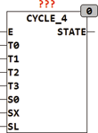

<!--
  Copyright (c) 2026 Hans Mühlbauer, Franz Höpfinger and others.

  This program and the accompanying materials are made available under the
  terms of the Eclipse Public License 2.0 which is available at
  https://www.eclipse.org/legal/epl-2.0

  SPDX-License-Identifier: EPL-2.0
-->

## Type	Funktionsbaustein

| | |
|:---|:---|
| **Input	E** | BOOL (Enable Eingang) |
| **T0 .. T3** | TIME (Laufzeit der einzelnen States) |
| **S0** | BOOL (kontinuierlicher Zyklus Enable) |
| **SX** | INT (State wenn SL = TRUE) |
| **SL** | BOOL (asynchroner Load Eingang) |
| **Output	STATE** | INT (Statusausgang) |
| | CYCLE_4 erzeugt wenn E = TRUE die States 0..3. Die Dauer jedes einzelnen States kann durch die Zeitvorgaben T0..T3 festgelegt werden. Der Eingang SL startet wenn TRUE ab einem vorgegebenen STATE SX. Der Eingang E hat den internen Default TRUE, so dass er auch offen gelassen werden kann. Nach einer Steigenden Flanke an E startet der Baustein immer mit STATE = 0, und wenn E = FALSE bleibt der Ausgang STATE auf 0. Mit dem Eingang S0 wird der Zyklische Modus eingeschaltet, Wenn S0 = FALSE stoppt der Baustein bei State = 3, ist S0 = TRUE so beginnt der Baustein nach State 3 wieder mit State 0. |

