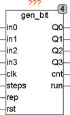
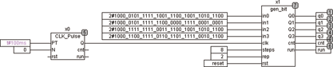
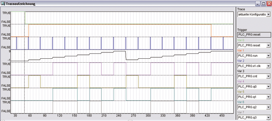

<!--
  Copyright (c) 2026 Hans Mühlbauer, Franz Höpfinger and others.

  This program and the accompanying materials are made available under the
  terms of the Eclipse Public License 2.0 which is available at
  https://www.eclipse.org/legal/epl-2.0

  SPDX-License-Identifier: EPL-2.0
-->

## Type	Funktionsbaustein

| | |
|:---|:---|
| **Input	IN0** | DWORD (Bitsequenz für Q0) |
| **IN1** | DWORD (Bitsequenz für Q1) |
| **IN2** | DWORD (Bitsequenz für Q1) |
| **IN3** | DWORD (Bitsequenz für Q1) |
| **CLK** | BOOL (Clock Eingang) |
| **STEPS** | INT (Anzahl der zu erzeugenden Takte) |
| **REP** | INT |
| **RST** | BOOL |
| **Output	Q0** | BOOL (Bitsequenz Q0) |
| **Q1** | BOOL (Bitsequenz Q1) |
| **Q2** | BOOL (Bitsequenz Q2) |
| **Q3** | BOOL (Bitsequenz Q3) |
| **CNT** | INT (Anzahl der bereits erzeugten Ausgangsbits) |
| **RUN** | BOOL (TRUE, wenn der Sequenzer läuft) |
| | GEN_BIT ist ein frei programmierbarer Bitmustergenerator. An den Eingängen in0 .. in7 liegen die Bitmuster jeweils als DWORD an und werden durch den Eingang CLK je Taktimpuls beginnend von Bit 0 an aufsteigend an die Ausgänge Q0 .. Q3 geschoben. Nach dem ersten Taktimpuls am Eingang CLK liegt am Ausgang Q0 Bit 0 von IN0, an Q1 liegt Bit 0 von In1 ... an Q7 liegt Bit 0 von IN3. Nach dem nächsten Taktimpuls am CLK Eingang wird jeweils das Bit 1 der Eingänge IN an die Ausgänge Q geschoben und so weiter, bis die Sequenz beendet ist. Der Eingang STEPS legt fest, wie viele Bits der Eingangs-DWORDS an die Ausgänge geschoben werden. Der Eingang REP legt fest, wie oft diese Sequenz wiederholt wird. Wird der Eingang  auf 0 gesetzt, so wird die Sequenz fortlaufend wiederholt. Ein asynchroner Reset kann jederzeit den Sequenzer zurücksetzen. Die Ausgänge RUN und CNT zeigen an, welches Bit gerade am Ausgang anliegt und ob der Sequenzer läuft, oder die Sequenz (RUN inaktiv) beendet ist. Nachdem die Sequenzen abgelaufen sind bleibt das letzte Bitmuster an den Ausgängen vorhanden, bis ein Reset den Generator neu startet. |

**Beispiel:**

Beispiel: In diesem Beispiel werden die untersten 8 Bits (Bit 0 .. 7 ) an den Eingängen IN auf die Ausgänge Q geschoben. Die Sequenz beginnt jeweils bei Bit 0 und endet bei Bit 7 (8 Steps sind durch den Eingang 8 definiert). Diese Sequenz wird 2 mal (2 Wiederholungen am Eingang REP) wiederholt und dann gestoppt. Die Trace Aufzeichnung zeigt das inaktiv werdende Reset Signal (Grün), welches den Generator startet und nach dem ersten Taktimpuls Bit 0 an die Ausgänge schiebt.
