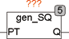

<!--
  Copyright (c) 2026 Hans Mühlbauer, Franz Höpfinger and others.

  This program and the accompanying materials are made available under the
  terms of the Eclipse Public License 2.0 which is available at
  https://www.eclipse.org/legal/epl-2.0

  SPDX-License-Identifier: EPL-2.0
-->

## Type	Funktionsbaustein

| | |
|:---|:---|
| **Input	PT** | TIME (Periodendauer) |
| **Output	Q** | BOOL (Ausgangssignal) |
| | Gen_SQ ist ein Rechteckgenerator mit programmierbarer Periodendauer und einem festen Tastverhältnis von 50%. Der Eingang PT legt die Periodendauer fest und am Ausgang Q steht das Ausgangssignal zur Verfügung. |
| | PTQ |

