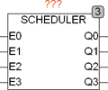

<!--
  Copyright (c) 2026 Hans Mühlbauer, Franz Höpfinger and others.

  This program and the accompanying materials are made available under the
  terms of the Eclipse Public License 2.0 which is available at
  https://www.eclipse.org/legal/epl-2.0

  SPDX-License-Identifier: EPL-2.0
-->

## SCHEDULER

| | |
|:---|:---|
| **Type** | Funktionsbaustein |
| **Input	E0..3** | BOOL (Freigabesignale für Q0..3) |
| **Output	Q0..3** | BOOL (Ausgangssignale) |
| | SCHEDULER wird benutzt um Programmteile Zeitabhängig aufzurufen. Z.B. können aufwendige Berechnungen die nur selten gebraucht werden in bestimmten Zeitabständen aufgerufen werden. Die Ausgänge Q* Des Bausteins werden jeweils nur für einen Zyklus aktiv und schalten dadurch die Abarbeitung des entsprechenden Programmteils frei. Die Setup Zeiten T* Legen fest in welchen Zeitabständen die Ausgänge aktiviert werden. SCHEDULER prüft je CPU Zyklus nur einen Ausgang, so dass maximal ein Ausgang je Zyklus aktiv sein kann. Im Extremfall wenn alle Aufrufzeiten T* T#0s sind wird in jedem Zyklus jeweils ein Ausgang gesetzt sein, so dass erst Q0, dann Q1 usw. bis Q3 gesetzt sind um dann wieder mit Q0 zu beginnen. Die Aufrufzeiten können deshalb um bis zu 3 CPU Zyklen vom vorgegebenen Wert T* Abweichen. |
| **Setup	T0..3** | TIME (Zykluszeit) |

