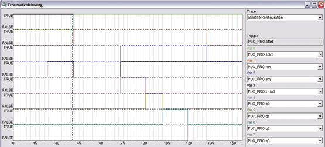

<!--
  Copyright (c) 2026 Hans Mühlbauer, Franz Höpfinger and others.

  This program and the accompanying materials are made available under the
  terms of the Eclipse Public License 2.0 which is available at
  https://www.eclipse.org/legal/epl-2.0

  SPDX-License-Identifier: EPL-2.0
-->

## Type	Funktionsbaustein

| | |
|:---|:---|
| **Input	IN0..3** | BOOL (Freigabesignal für Q0..3) |
| **START** | BOOL (Startflanke für den Sequenzer) |
| **RST** | BOOL (Asynchroner Reset-Eingang) |
| **WAIT 0..3** | TIME (Wartezeit für das Eingangssignal an IN 0..3) |
| **DELAY 0..3** | TIME (Verzögerungszeit bis das Eingangssignal 	IN0..3 	geprüft wird) |
| **Output	Q 0..3** | BOOL (Steuerausgänge) |
| **QX** | BOOL (TRUE, wenn einer der Ausgänge Q0..Q3 aktiv ist) |
| **RUN** | BOOL (RUN ist TRUE, wenn der Sequenzer läuft) |
| **STEP** | INT (gibt den momentanen Schritt an) |
| **STATUS** | BYTE (zu ESR kompatibler Status-Ausgang) |
| | SEQUENCE_4 ist ein 4 Bit Sequenzer mit Steuereingängen. Nach einer steigenden Flanke an START wird RUN TRUE und der Sequenzer wartet die Zeit Wait0 auf ein TRUE-Signal am Eingang IN0. Nachdem das Signal am IN0 TRUE ist, wird der Ausgang Q0 gesetzt und die Zeit Delay0 abgewartet. Nach Ablauf der Zeit Delay0 wird im nächsten Zyklus für die Zeit wait1 auf ein Eingangssignal an in1 gewartet und Q0 bleibt solange TRUE, bis Q1 gesetzt wird. Das ganze wird solange wiederholt, bis alle 4 Zyklen abgelaufen sind. Falls während den Wartezeiten wait0..3 der entsprechende Eingang nicht TRUE wird, wird ein Fehler gesetzt, indem die entsprechende Error-Nummer am Ausgang STATUS angezeigt wird und abhängig von der Setup-Variable STOP_ON_ERROR wird der Sequenzer angehalten oder nicht. Der STATUS-Ausgang ist 110 für warten auf Startsignal und 111 wenn die Sequenz durchlaufen wird und zeigt mit 1 .. 4 Fehler an. Ein Error = 1 bedeutet, dass das Signal am Eingang in0 nicht aktiv wurde eine 2 entspricht in1 usw. Die Ausgänge RUN und STEP zeigen an, ob der Sequenzer läuft und in welchem Zyklus er sich gerade befindet. Der Ausgang QX ist TRUE, wenn einer der Ausgänge Q0..Q3 TRUE ist. |

| | Ein asynchroner Reset-Eingang kann den Sequenzer jederzeit zurücksetzen. Dieser Reset-Eingang kann auch mit einem der Ausgänge Q0..Q3 beschaltet werden um den Sequenzer vor dem vollen Ablauf zu stoppen. Der Sequenzer kann auch jederzeit mit einer steigenden Flanke am Eingang START wieder von neuem gestartet werden. Das gilt auch, wenn er eine Sequenz noch nicht beendet hat. |
| | Sollte eine Flankenprüfung an einem oder mehreren Eingängen IN nicht nötig sein, so können sie einfach offen gelassen werden, denn der Vorgabe-Wert für diese Eingänge ist TRUE. |
| | Der Ausgang Status ist ESR kompatibel und zeigt durch einen Wert 1- 4  an, dass ein Fehler aufgetreten ist. Ein Fehler tritt dann auf, wenn das entsprechende Eingangssignal an IN nicht während der entsprechenden Wartezeit auftritt. |
| | Error = 1 bedeutet, dass in0 nicht innerhalb der Wartezeit aktiv geworden ist. Error 2 .. 4 entspricht den Eingängen 1 .. 3. |
| | Ein Statuswert von 110 bedeutet Wartestellung und 111 bedeutet, dass gerade eine Sequenz durchlaufen wird. |

**Beispiel:**

Beispiel: Im Folgenden Beispielwird mit einer steigenden Flanke an Start der Sequenzer gestartet. Gleichzeitig wird ein Puls-Generator TP mit 2 Sekunden gestartet und damit das Startsignal mit 2 Sekunden Verzögerung auf den Eingang IN0 gelegt. Der Sequenzer setzt unmittelbar nach dem Startimpuls das Ausgangssignal RUN und wartet dann für maximal 5 Sekunden auf ein Signal an IN0. Mit der steigenden Flanke an IN0, dass nach 2 Sekunden von TP generiert wird, wird Q0 gesetzt und ein Delay von 1 Sekunde abgewartet. Damit ist der erste Schritt beendet und die restlichen Schritte werden ohne auf ein Eingangssignal an in1..3 zu warten ausgeführt. Die Vorgabewerte für die Eingänge IN sind TRUE, wenn sie unbeschaltet sind. Die Traceaufzeichnung zeigt das Startsignal (Grün) und das Signal RUN (Rot). Nach 2 Sekunden wird die steigende Flanke am Eingang auf in0 und danach auf die Ausgangssignale Q0..3 und QX gelegt. Das Signal QX (Blau) ist dann aktiv, wenn eines der Ausgangssignale aktiv ist und das Signal RUN (Rot) ist vom Start bis zum Ende aktiv.
