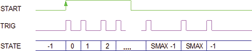

<!--
  Copyright (c) 2026 Hans Mühlbauer, Franz Höpfinger and others.

  This program and the accompanying materials are made available under the
  terms of the Eclipse Public License 2.0 which is available at
  https://www.eclipse.org/legal/epl-2.0

  SPDX-License-Identifier: EPL-2.0
-->

## Type	Funktionsbaustein

| | |
|:---|:---|
| **Input	START** | BOOL (steigende Flanke startet die Sequenz) |
| **SMAX** | INT (letzter State der Sequenz) |
| **PROG** | ARRAY[0..63] OF TIME (Zeitdauer der einzelnen States) |
| **RST** | BOOL (Asynchroner Reset-Eingang) |
| **Output	STATE** | INT (State Ausgang) |
| **TRIG** | BOOL (Zeigt Zustandsveränderungen mit TRUE an) |
| | SEQUENCE_64 erzeugt eine Zeitsequenz von bis zu 64 Zuständen. Im Ruhezustand steht der Ausgang STATE auf -1 und zeigt damit an das der Baustein nicht aktiv ist. Eine steigende Flanke an START startet die Sequenz und der Ausgang STATE schaltet auf 0. nach Ablauf der Wartezeit PROG[0] schaltet der Baustein weiter auf STATE = 1, Wartet die Zeit PROG[1] ab, schaltet auf STATE = 2, usw... bis der Ausgang STATE den Wert von SMAX erreicht hat. Nach Ablauf der Wartezeit PROG[SMAX] geht der Baustein wieder in den Ruhezustand (STATE = -1). Einen Wechsel auf einen neuen Zustand von STATE signalisiert der Ausgang TRIG mit einem TRUE für einen SPS Zyklus. Mit TRIG können bequem nachgeschaltet Bausteine gesteuert werden. Mit dem Eingang RST kann der Baustein jederzeit auch während des Ablaufs einer Sequenz in den Ausgangszustand zurückgesetzt werden. |
| **Signalverlauf von SEQUENCE_64** |  |

