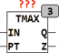

<!--
  Copyright (c) 2026 Hans Mühlbauer, Franz Höpfinger and others.

  This program and the accompanying materials are made available under the
  terms of the Eclipse Public License 2.0 which is available at
  https://www.eclipse.org/legal/epl-2.0

  SPDX-License-Identifier: EPL-2.0
-->

## Type	Funktionsbaustein

| | |
|:---|:---|
| **Input	IN** | BOOL (Eingangssignal) |
| **PT** | TIME (Ausschaltverzögerung) |
| **Output	Q** | BOOL (Ausgangssignal) |
| **Z** | BOOL (Trigger Ausgang) |
| | TMAX begrenzt die Dauer des Ausgangsimpulses auf die Zeit PT. Der Ausgang Q folgt dem Eingang IN, solange die TRUE Zeit von IN kürzer als PT ist. Ist IN länger als PT auf TRUE so wird der Ausgangsimpuls verkürzt. Immer dann wenn ein Ausgang durch eine Zeitüberschreitung auf FALSE geht wird der Ausgang Z für einen Zyklus auf TRUE gesetzt. |

