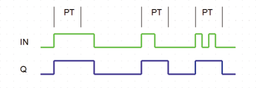

<!--
  Copyright (c) 2026 Hans Mühlbauer, Franz Höpfinger and others.

  This program and the accompanying materials are made available under the
  terms of the Eclipse Public License 2.0 which is available at
  https://www.eclipse.org/legal/epl-2.0

  SPDX-License-Identifier: EPL-2.0
-->

## Type	Funktionsbaustein

| | |
|:---|:---|
| **Input	IN** | BOOL (Eingangssignal) |
| **PT** | TIME (Ausschaltverzögerung) |
| **Output	Q** | BOOL (Ausgangssignal) |
| | TMIN stellt sicher das der Ausgangsimpuls Q mindestens PT auf TRUE bleibt, auch wenn der Eingangsimpuls an IN kürzer als PT ist. ansonsten folgt der Ausgang Q dem Eingang IN. |

