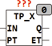
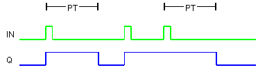

<!--
  Copyright (c) 2026 Hans Mühlbauer, Franz Höpfinger and others.

  This program and the accompanying materials are made available under the
  terms of the Eclipse Public License 2.0 which is available at
  https://www.eclipse.org/legal/epl-2.0

  SPDX-License-Identifier: EPL-2.0
-->

## Type	Funktionsbaustein

| | |
|:---|:---|
| **Input	IN** | BOOL (Eingangssignal) |
| **PT** | TIME (Impulsdauer) |
| **Output	Q** | BOOL (Ausgangspuls) |
| **ET** | TIME (Zähle die Abgelaufene Zeit des Ausgangspulses) |
| | TP_X ist ein mehrfach triggerbarer Impulsgenerator. Im Gegensatz zum Standardbaustein TP kann dieser Baustein mehrfach getriggert werden und dadurch der Ausgangsimpuls verlängert werden. Der Ausgang Q bleibt nach dem letzten Triggerereignis (steigende Flanke an IN) für die Zeit PT auf ein. Während Q TRUE ist, kann jederzeit durch eine weitere Eingangsflanke an IN der Timer wieder getriggert werden und der Ausgangsimpuls dadurch verlängert werden. Im Gegensatz zu TOF wird bei TP_X die Zeit PT ab der letzten steigenden Flanke gemessen, unabhängig wie lange  IN auf TRUE bleibt. Das bedeutet das der Ausgang Q nach Ablauf der Zeit PT gemessen von der letzten steigenden Flanke an IN auf FALSE geht, auch wenn der Eingang IN noch TRUE ist. |
| **Zeitverhalten von TP_X** |  |

