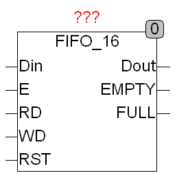

<!--
  Copyright (c) 2026 Hans Mühlbauer, Franz Höpfinger and others.

  This program and the accompanying materials are made available under the
  terms of the Eclipse Public License 2.0 which is available at
  https://www.eclipse.org/legal/epl-2.0

  SPDX-License-Identifier: EPL-2.0
-->

## Type	Funktionsbaustein

| | |
|:---|:---|
| **Input	DIN** | DWORD (Daten Eingang) |
| **E** | BOOL (Freigabe Eingang) |
| **RD** | BOOL (Lese Kommando) |
| **WD** | BOOL (Schreib Kommando) |
| **RST** | BOOL (Reset Eingang) |
| **Output	DOUT** | DWORD (Daten Ausgang) |
| **EMPTY** | BOOL (EMPTY  = TRUE bedeutet: Speicher ist Leer) |
| **FULL** | BOOL (FULL = TRUE bedeutet: Speicher ist Voll) |
| | FIFO_16 ist ein First-In First-Out Speicher mit 16 Speicherstellen für DWORD Daten. Die beiden Ausgänge EMPTY  und FULL zeigen an, wann der Speicher voll oder leer ist. Der Eingang RST löscht den gesamten Inhalt des Speichers. Der FIFO wird mit DIN beschrieben, indem ein TRUE auf den Eingang WD, und ein TRUE-Puls auf den Eingang E gegeben werden. Ein Lesebefehl wird ausgeführt indem TRUE auf RD und TRUE auf E gelegt wird. Lesen und Schreiben kann gleichzeitig in einem Zyklus ausgeführt werden. Der Baustein Liest oder Schreibt in jedem Zyklus solange das entsprechende Kommando (RD, WD) auf TRUE steht. |

