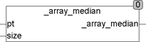

<!--
  Copyright (c) 2026 Hans Mühlbauer, Franz Höpfinger and others.

  This program and the accompanying materials are made available under the
  terms of the Eclipse Public License 2.0 which is available at
  https://www.eclipse.org/legal/epl-2.0

  SPDX-License-Identifier: EPL-2.0
-->

## Type	Funktion : REAL

| | |
|:---|:---|
| **Input	PT** | Pointer (Zeiger auf das Array) |
| **SIZE** | UINT (Größe des Arrays) |
| **Output** | REAL (Medianwert des Arrays) |
| **Die Funktion _ARRAY_MEDIAN ermittelt den Medianwert eines beliebigen Arrays of REAL. Beim Aufruf wird der Funktion ein Pointer auf das Array und dessen Größe in Bytes übergeben. Unter CoDeSys lautet der Aufruf** | _ARRAY_MEDIAN(ADR(Array), SIZEOF(Array)), wobei Array der Name des zu manipulierenden Arrays ist. ADR() ist eine Standardfunktion, die den Pointer auf das Array ermittelt und SIZEOF() ist eine Standardfunktion, die die Größe des Arrays ermittelt. Um den Medianwert zu ermitteln wird das durch den Pointer referenzierte Array direkt im Speicher sortiert und bleibt nach beenden der Funktion sortiert. Die Funktion _ARRAY_MEDIAN verändert also den Inhalt des Arrays. |
| | Diese Art der Bearbeitung von Arrays ist äußerst effizient, da kein zusätzlicher Speicher benötigt wird und keine Übergabewerte kopiert werden müssen. |
| | Sollte ein Array bearbeitet werden, das nicht verändert werden darf, so ist es vor Übergabe des Pointer und Aufruf der Funktion in ein temporäres Array zu kopieren. |



**Beispiel:**

```iecst
_ARRAY_MEDIAN(ADR(bigarray), SIZEOF(bigarray)) Medianwert:
```
Der Medianwert ist der Mittlere Wert einer sortierten Wertemenge.
Median von (12, 0, 4, 7, 1) ist 4. Nach dem Ausführen der Funktion bleibt das Array sortiert im Speicher zurück (0, 1, 4, 7, 12). Wenn das Array eine gerade Anzahl von Elementen enthält ist der Medianwert der Mittelwert aus den beiden mittleren Werten des Arrays.
