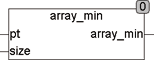

<!--
  Copyright (c) 2026 Hans Mühlbauer, Franz Höpfinger and others.

  This program and the accompanying materials are made available under the
  terms of the Eclipse Public License 2.0 which is available at
  https://www.eclipse.org/legal/epl-2.0

  SPDX-License-Identifier: EPL-2.0
-->

## ARRAY_MIN

| | |
|:---|:---|
| **Type	Funktion** | REAL |
| **Input	PT** | Pointer (Zeiger auf das Array) |
| **SIZE** | UINT (Größe des Arrays) |
| **Output** | REAL (Minimalwert des Arrays) |
| **Die Funktion ARRAY_MIN ermittelt den Minimalwert eines beliebigen Arrays of REAL. Beim Aufruf wird der Funktion ein Pointer auf das Array und dessen Größe in Bytes übergeben. Unter CoDeSys lautet der Aufruf** | ARRAY_MIN(ADR(Array), SIZEOF(Array)), wobei Array der Name des zu durchsuchenden Arrays ist. ADR() ist eine Standardfunktion, die den Pointer auf das Array ermittelt und SIZEOF() ist eine Standardfunktion, die die Größe des Arrays ermittelt. Um den Maximalwert zu ermitteln wird das durch den Pointer referenzierte Array direkt im Speicher durchsucht. Die Funktion ARRAY_MIN verändert den Inhalt des Arrays nicht. |
| | Diese Art der Bearbeitung von Arrays ist äußerst effizient, da kein zusätzlicher Speicher benötigt wird und keine Übergabewerte kopiert werden müssen. |



**Beispiel:**

```iecst
ARRAY_MIN(ADR(bigarray), SIZEOF(bigarray))
```
