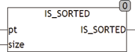

<!--
  Copyright (c) 2026 Hans Mühlbauer, Franz Höpfinger and others.

  This program and the accompanying materials are made available under the
  terms of the Eclipse Public License 2.0 which is available at
  https://www.eclipse.org/legal/epl-2.0

  SPDX-License-Identifier: EPL-2.0
-->

## Type	Funktion : BOOL

| | |
|:---|:---|
| **Input	PT** | Pointer (Zeiger auf das Array) |
| **SIZE** | UINT (Größe des Arrays) |
| **Output** | BOOL (TRUE) |
| **Die Funktion IS_SORTED prüft ob ein beliebiges Array of REAL in aufsteigender Reihenfolge sortiert ist. Beim Aufruf wird der Funktion ein Pointer auf das zu sortierende Array und dessen Größe in Bytes übergeben. Unter CoDeSys lautet der Aufruf** | _ARRAY_SORT(ADR(Array), SIZEOF(Array)), wobei Array der Name des zu sortierenden Arrays ist. ADR ist eine Standardfunktion, die den Pointer auf das Array ermittelt und SIZEOF ist eine Standardfunktion, die die Größe des Arrays ermittelt. |
| | Die Funktion liefert TRUE zurück wenn das Array in aufsteigender Reihenfolge sortiert ist. |
| | Diese Art der Bearbeitung von Arrays ist äußerst effizient, da kein zusätzlicher Speicher benötigt wird und keine Übergabewerte kopiert werden müssen. |



**Beispiel:**

```iecst
IS_SORTED(ADR(bigarray), SIZEOF(bigarray))
```
